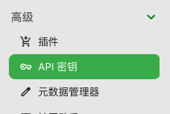
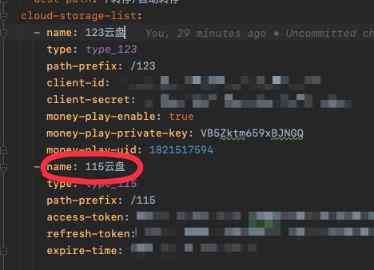
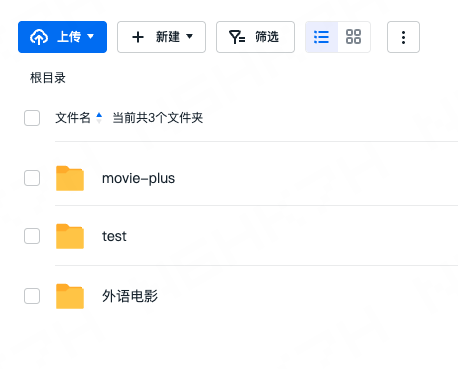
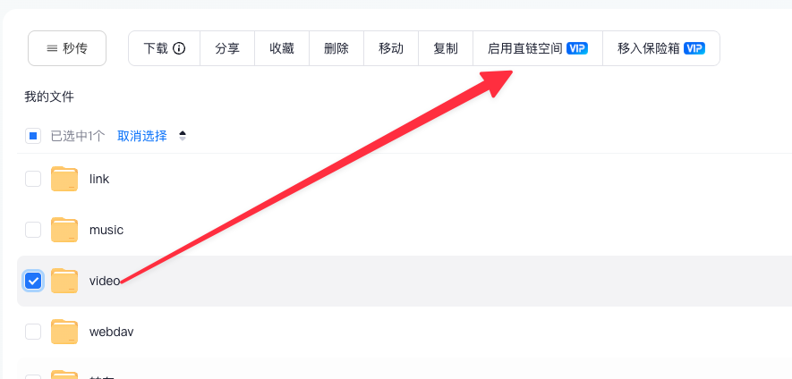
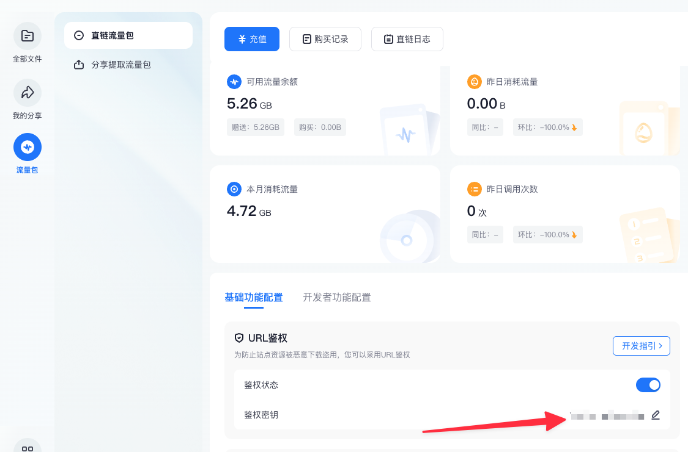
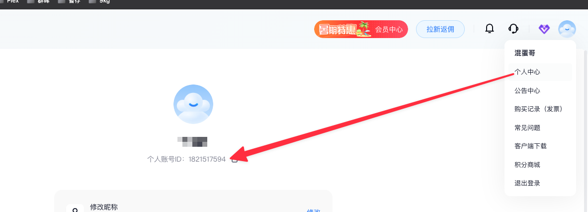

# application-user.yaml配置文件说明

## emby-plus.lan-ip（非必填）
这个配置用来控制内网是否走直连
* 内网ip段，只填开头部分即可，比如你得内网是192.168.x.x，只需要填192.168即可，多个内网段使用英文逗号(,)分隔

## emby-plus.strm-prefix-path
如果你使用了strm，需要配置这个
* 如果你使用了strm，这里把strm前缀填写在这里，多个前缀使用英文逗号(,)分隔, 如果未使用strm，这里删除即可（strm前缀是什么请看文档中关于strm前缀说明的部分）
* 注意：这里的strm路径请不要把strm内容中的路径前缀部分也填入这里
* 例如你的strm文件内容是 `http://xxxxx:19798/123云盘/video/电影/国产/xxx.mkv` 这里填入`http://xxxxx:19798`即可， `/123云盘`可以作为`path-prefix`值
## emby-plus.emby（必填）
这一部分配置了movie-plus链接emby的配置
* emby-plus.emby.host （非必填）
  * 这个配置只有当你同时对接emby和plex时需要填写，只对接emby的话可以删掉
  * 这里填写外网或内网通过movie-plus访问emby的域名部分，
  * 如果外网访问emby的地址是https://emby.xxxx.com:8888，这里就填emby.xxx.com，当然这时候如果你内网反问的话也必须要用这个域名才行
  * 如果你没有外网环境，只有内网环境，你的地址可能是这样的http://192.168.50.1:8888，这里只需要填入192.168.50.1即可

* emby-plus.emby.inner-address（必填项）
  * 如果之前使用过emby-plus的话，将emby-plus配置文件中的emby-plus.emby.host填这里即可 
  * 这里配置的是你的movie-plus和emby通信的链接地址，不是你外网访问movie-plus的地址
  * 如果你的movie-plus和emby都是通过容器部署的，这里的地址可能是http://172.17.0.1:8096（视具体情况而定）

* emby-plus.emby.api-key （必填项）
  * 这个不是激活码、不是激活码
  * 进入emby服务端后台，在高级-API密钥中查看，如果没有就创建一个

    

* emby-plus.emby.cache-path （非必填，默认true）
  * 是否在movie-plus启动时对emby媒体库的目录地址提前缓存
  * 这里缓存的是媒体库目录地址对应网盘的文件ID，后续播放视频时可以少调用几次网盘接口

## emby-plus.plex（非必填）
这个配置项配置了movie-plus对接plex的相关配置

* emby-plus.plex.host（必填项）
  * 说明同emby-plus.emby.host
* emby-plus.plex.inner-address（必填项）
  * 说明同emby-plus.emby.inner-address
* emby-plus.plex.api-key（必填项）
  * plex的api-key需要浏览器进入F12自己通过网络请求抓取

## emby-plus.auto-transfer（非必填，默认不启用）
这个配置是关于自动转存的相关配置，现在只支持115转存123

* emby-plus.auto-transfer.enable（非必填，默认false）
  * 是否启用自动转存功能

* emby-plus.auto-transfer.period-minute（非必填，默认10）
  * 自动转存每次间隔多久运行一次，单位：分钟

* emby-plus.auto-transfer.source-cloud-storage-name（必填）
  * 转存源头的网盘名称，例如你从名称为‘115网盘’的网盘转存到名称为‘123网盘’，这里填115网盘即可
  * 名称要和emby-plus.cloud-storage-list中配置的name值一样

  

* emby-plus.auto-transfer.source-path（必填）
  * 想从115网盘的哪个目录转存到123网盘就填哪个目录
  * 这里不是你的cd2挂在路径，也不是其他什么路径
  * 这个路径要看你网盘的真实地址，例如你网盘跟目录下有一个test文件夹，你想转存他的话就填`/test`
    
  

* emby-plus.auto-transfer.dest-cloud-storage-name（必填）
  * 转存目的的网盘名称，要求和emby-plus.auto-transfer.source-cloud-storage-name一样

* emby-plus.auto-transfer.dest-path（必填）
  * 转存目的地的网盘路径，要求和emby-plus.auto-transfer.source-path一样

* emby-plus.cloud-storage-list（必填）
这里配置你的网盘信息，支持配置多个115网盘和123网盘

* emby-plus.cloud-storage-list.name（必填）
  * 网盘名称，名称要求唯一，不能重复，自己取一个名字即可

* emby-plus.cloud-storage-list.type（必填项）
  * 当前可选值只有2个
    * type_123：123云盘
    * type_115：115云盘
* emby-plus.cloud-storage-list.path-prefix
  * 网盘匹配路径前缀
  * 举个例子：
    * 比如你的123网盘通过CloudDrive挂在到本地的`/volume1/CloudDrive/123云盘`这个路径下
    * 然后你的emby容器中将路径`/volume1/CloudDrive/123云盘`挂载成`/123云盘`
    * 这时候你的emby影视仓中可能会有一个路径为`/123云盘/video/电影/国产电影/xxxx.mkv`的电影
    * 当你播放这个视频文件的时候，如果你的`path-refix`值配置的时`/123云盘`时，那么movie-plus就成功匹配到你当前配置的云盘
    * 如果你的emby是套件部署的话，那么这里直接填入`/volume1/CloudDrive/123云盘`即可，movie-plus会根据路径前缀去匹配
  * 注意：
    * 因为是前缀匹配，所以你的众多path-prefix中不能同时出现类似`123云盘`和`123云盘1`这样的前缀重复的路径，你可以改成`123云盘1`和`123云盘2`
* emby-plus.cloud-storage-list.client-id（123云盘必填）
  * 这里填入你再123开放平台申请的client-id

* emby-plus.cloud-storage-list.client-secret（123云盘必填）
  * 这里填入你再123开放平台申请的client-secret

* emby-plus.cloud-storage-list.money-play-enable (123云盘-非必填，默认false)
  * 这个配置表示是否启用123云盘的花钱直连播放（这里的直连会走123云盘的直连流量，需要花钱购买流量）
  * 只有123云盘可以开启这个功能
  * 需要提前在你的123云盘的文件夹上启用直连空间
  * true表示启用，false表示不启用，如果不启用可以删除该配置

  

* emby-plus.cloud-storage-list.money-play-private-key（如果启用了123云盘的花钱直连播放，这里必须填写）
  * 这里填入你在123云盘网站配置的URL鉴权密钥
  * 要求鉴权状态为启用状态
  
  

* emby-plus.cloud-storage-list.money-play-uid（如果启用了123云盘的花钱直连播放，这里必须填写）
  * 这里填入123云盘用户的uid

  

* emby-plus.cloud-storage-list.access-token（115云盘必填）
  * 115云盘扫码获取的access-token
  * 由于115云盘的token需要扫码获取，只能通过这种方式
  * 只需要在首次添加115云盘时填写该值，后续movie-plus会自动维护token的刷新
* emby-plus.cloud-storage-list.refresh-token（115云盘必填）
  * 115云盘扫码获取的refresh-token
* emby-plus.cloud-storage-list.expire-time（115云盘必填）
    * 115云盘扫码获取的expire-time